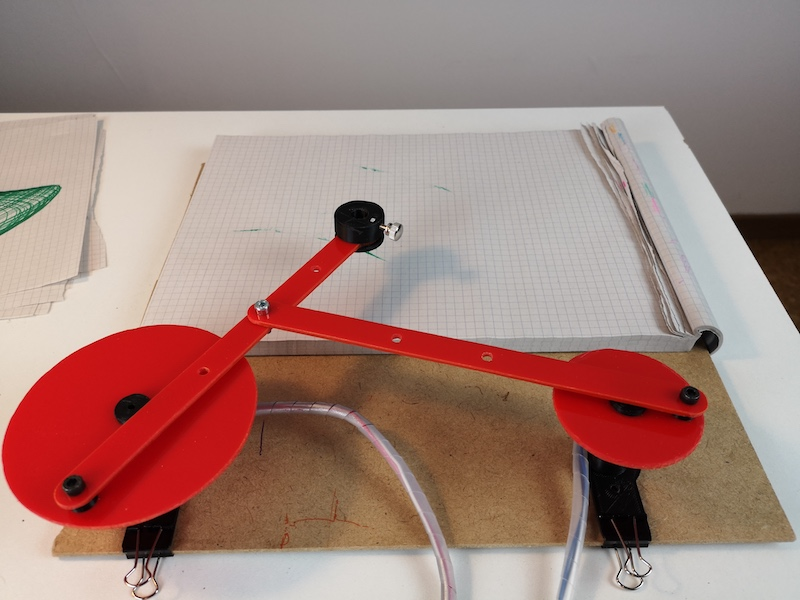

# Arduino MKR1000 Drawing Machine
## A two-motors drawing machine you can control from the cloud
**The mechanics is based on the BBC micro:bit [Drawing Machine](https://alicemirror.github.io/drawingmachine/)**

