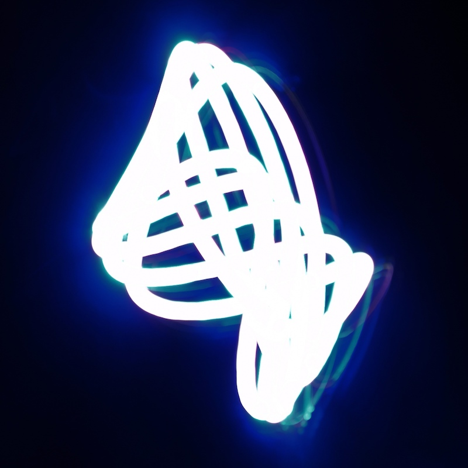
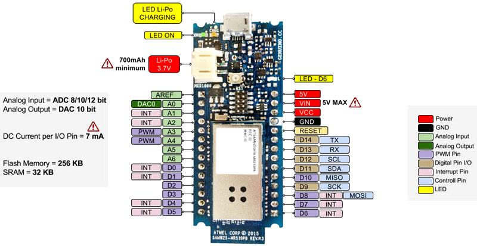

# Arduino MKR1000 Drawing Machine
## A two-motors drawing machine you can control from the cloud

This project reflects the content and settings of the Arduino IoT Cloud *DrawingControls* thing. The sources settings and pin assignment refers to the Arduino MKR1000. The same sketch can be easily changed to be adapted to any other Arduino boards (tested on Arduino MKR1010, Arduino UNO R3 and Arduino Mega 2560). Below the MKR1000 board pin assignment.

*The mechanic design is based on the BBC micro:bit [Drawing Machine](https://alicemirror.github.io/drawingmachine/)*

